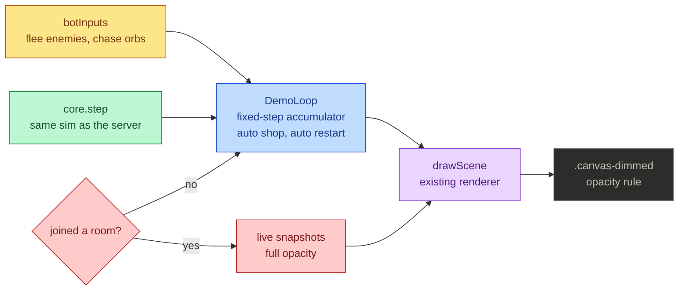

# Attract Mode

A dimmed, bot-driven game runs behind every pre-game screen, so the menus
float over live bullet-hell action instead of a black void.

## Mutual Understanding

Agreed in conversation on 2026-07-23.

- Behind auth, consent, group, and ready screens, the real simulation runs
  locally with three AI bots (initial-letter bubbles) fighting waves,
  auto-picking gear, dying, and restarting forever.
- The canvas renders it at dimmed opacity so foreground panels stay
  readable.
- The moment the player joins a room, the demo stops and the canvas belongs
  to the live game. No server traffic, no audio, no HUD for the demo.

## How It Runs

Nothing is faked: the background action is the exact simulation players
fight in, seeded deterministically, driven by a pure bot-input function.
