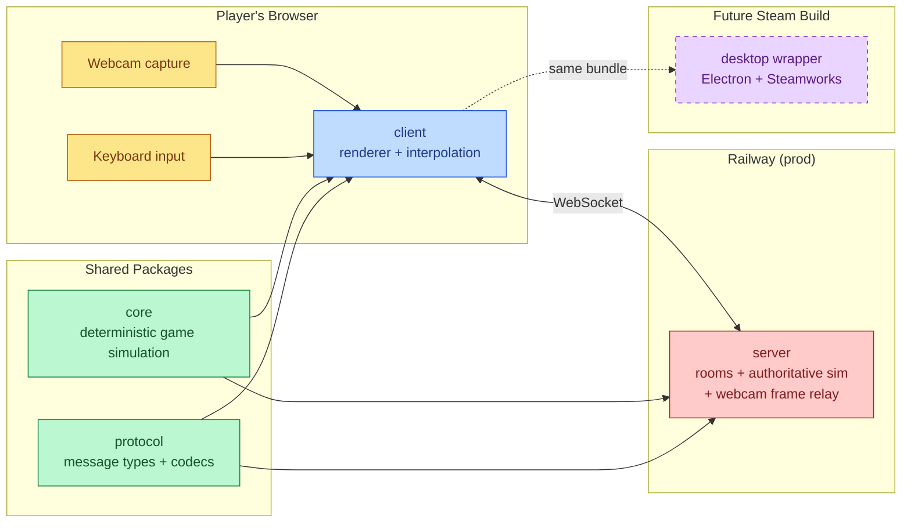
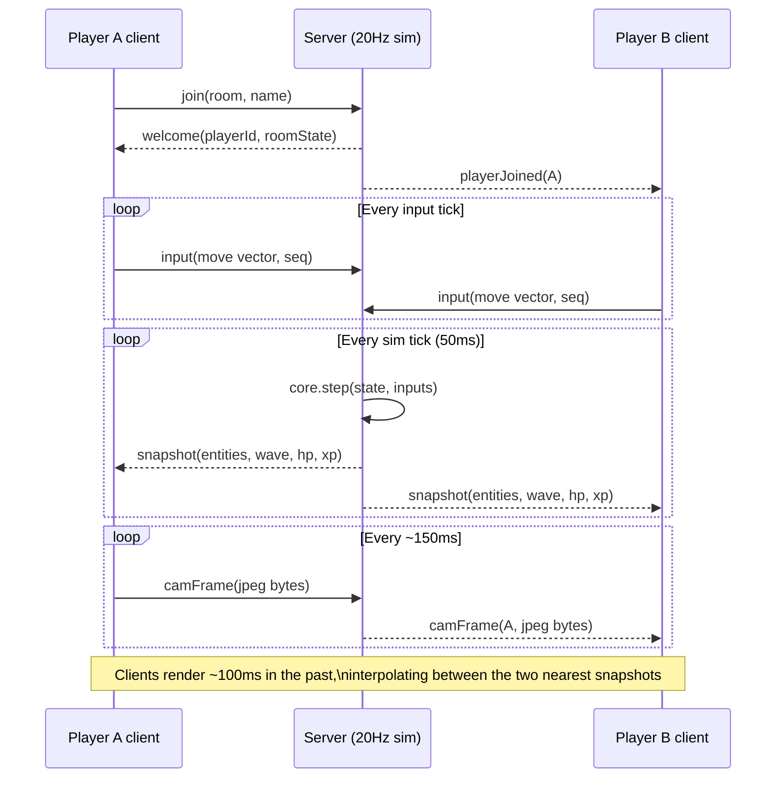
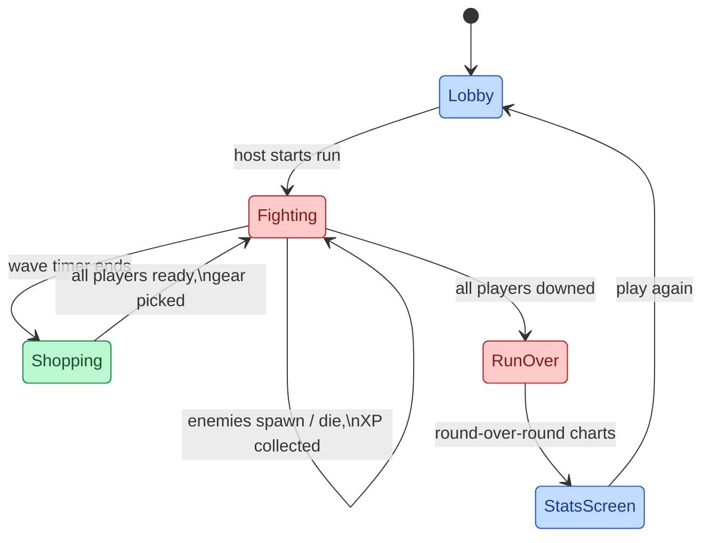

# Bullet Friends

A browser-based co-op bullet-heaven arena game in the style of a simplified Brotato,
where each player's character body is a live circular rendering of their own webcam.

## Mutual Understanding

Agreed in conversation on 2026-07-22.

- Players open a website, allow webcam access, and join a shared room with friends.
- Each player is a circle whose fill is their live webcam feed. Friends see each
  other's webcam bubbles in real time.
- Together they fight waves of enemies. Weapons auto-fire at the nearest enemy;
  players focus on movement and positioning, Brotato-style.
- Killing enemies drops XP. Leveling up between waves offers a choice of gear.
- Gear is strapped comically onto the webcam bubble (hats, glasses, weapons) and
  modifies stats (damage, fire rate, move speed, max HP, pickup radius).
- A stats screen shows each player's growth round over round.
- Art is free/open licensed (CC0 preferred) and looks good.
- Multiplayer sync is high-performance: server-authoritative simulation with
  client interpolation, not naive broadcast of everything.
- The site deploys to production automatically via GitHub Actions CI/CD:
  client to GitHub Pages, sync server to Railway.
- The codebase is deliberately structured so the same game core can later ship
  as a cross-platform Steam build via a desktop wrapper, without rewriting.

## System Architecture

The game simulation lives entirely in `core` and runs on the server. Client and
server import identical rules, so the client can render meaningfully between
snapshots and a future Steam build can run the sim locally for solo play.

## Netcode

Webcam bubbles are shared as small JPEG frames relayed through the server rather
than WebRTC. This trades some frame rate for zero TURN/STUN infrastructure and
one connection to reason about, which is the right trade for a co-op game where
the bubble is an avatar, not a video call.

## Round Lifecycle

## Steam-Readiness Constraints

- `core` and `protocol` never touch DOM, Node, or network APIs directly.
- The client accesses camera, storage, and fullscreen through a
  `PlatformServices` interface with a browser implementation now and room for a
  Steam/Electron implementation later.
- The server is optional for solo play in the future desktop build because the
  sim is a pure function of state + inputs.
