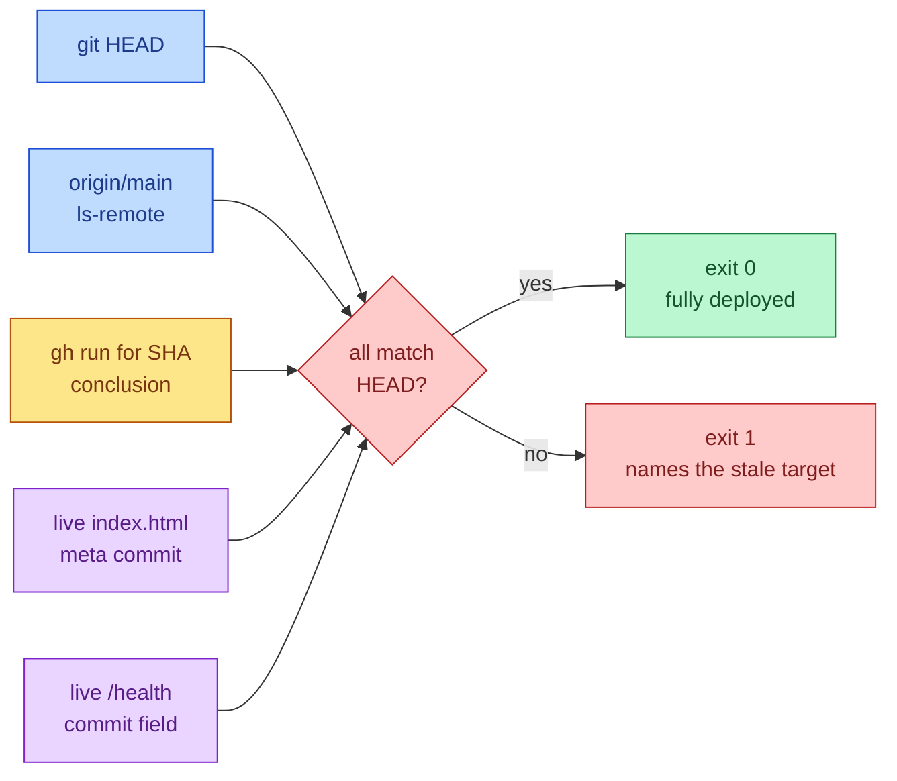
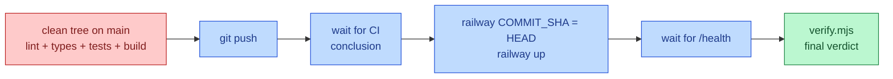

# Deploy Skills

Two code-first micro skills: `deploy-bullet-friends` runs the whole deploy
pipeline, and `deploy-bullet-friends-verification` answers one question
deterministically: is the latest commit actually live in prod?

## Mutual Understanding

Agreed in conversation on 2026-07-24.

- Both skills live under `.claude/skills/` and are code-first: each
  `SKILL.md` instructs running its bundled script, which does all the work
  and exits non-zero on any failure.
- `deploy-bullet-friends/deploy.mjs`: verify clean tree on main, run the
  full local gate (lint, typecheck, tests, build), push, wait for the CI
  run to conclude, stamp `COMMIT_SHA` on Railway and `railway up`, wait for
  health, then chain into the verification script.
- To make verification deterministic, both deploy targets get stamped with
  the commit SHA at build/deploy time: the Pages build embeds it in a
  `<meta name="commit">` tag, and the server's `/health` reports a `commit`
  field from a `COMMIT_SHA` env var.
- The script compares: local HEAD, origin/main, the CI conclusion for that
  SHA, the live client's embedded SHA, and the live server's reported SHA,
  then prints a per-check verdict.

## Verification Flow

## Deploy Pipeline

