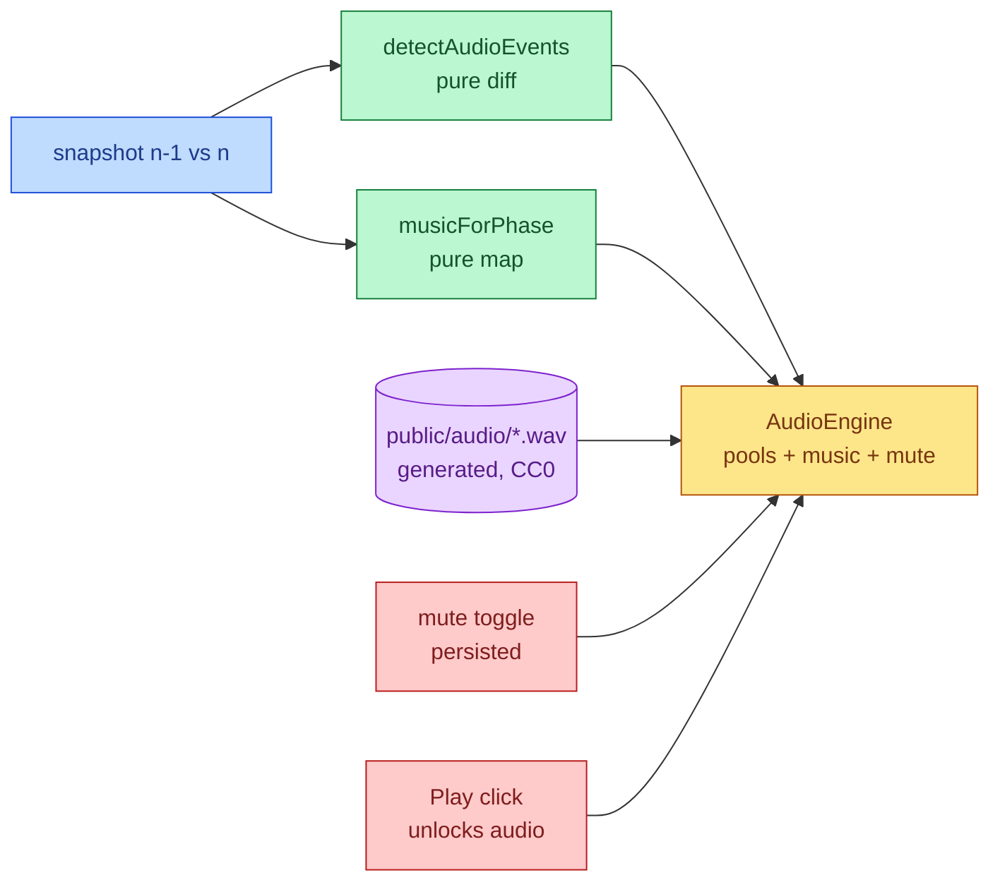

# Game Audio

Sound effects for game events and looping background music, from free CC0
assets, with a persisted mute control.

## Mutual Understanding

Agreed in conversation on 2026-07-23.

- Sound effects: firing, enemy hit, enemy down, orb pickup, level up, gear
  pick, countdown ticks, wave start, player down, run over.
- Looping music: an energetic loop while fighting, a calm loop in lobby,
  shop, and stats screens.
- Assets are free/CC0. Kenney's packs sit behind a scripted download modal,
  so the assets are first-party: a committed generator renders every WAV
  deterministically and they ship as our own CC0 files (ASSETS.md updated).
- A mute toggle sits in the corner of the app and persists across visits.
- Audio unlocks on the Play click, respecting browser autoplay rules.

## Audio Flow

Everything audible is derived from state the client already has: events come
from diffing consecutive snapshots, music from the current phase. The engine
is the only piece that touches the DOM audio APIs.
