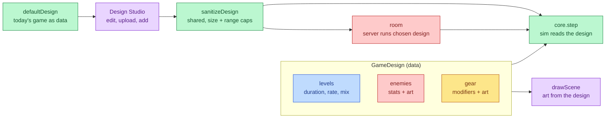

# Game Designer

Players design their own versions of the game: custom levels, custom
enemies, custom gear — stats, art, and new entries — saved to their account
and playable with their group.

## Mutual Understanding

Agreed in conversation on 2026-07-24.

- A Design Studio opens from the lobby. The current game is the starting
  template for every new design.
- Levels are built one at a time: each level has a duration, a spawn rate,
  and a mix of enemies. Runs past the last designed level repeat it with
  the usual difficulty scaling.
- The Enemies section shows every enemy rendered with its art beside its
  stats (hp, speed, size, touch damage, xp, spawn weight), all editable; an
  image upload replaces the art; new enemies can be added.
- The Gear section is the same pattern: rendered art, editable stat
  modifiers, uploadable art, new items.
- Designs persist per account (Firestore, size-capped uploads keep the $0
  posture; images are downscaled client-side before saving).
- On Play, the player picks a design ("Classic" or one of their own); the
  room's server-authoritative simulation runs that design for everyone in
  the room.

## The Engine Becomes Design-Driven



## Playing a Custom Design

```mermaid
sequenceDiagram
    participant D as Designer (host)
    participant S as Server
    participant F as Friend

    D->>S: POST /api/designs (save draft)
    S-->>D: { id }
    D->>S: join(group room)
    F->>S: join(group room)
    D->>S: setDesign(design)
    S->>S: sanitizeDesign — reject or adopt
    S-->>D: design broadcast
    S-->>F: design broadcast
    D->>S: start
    Note over S: simulation steps with the design;\nsnapshots carry custom enemy ids
    S-->>D: snapshots
    S-->>F: snapshots
    Note over D,F: both render custom art from the\nbroadcast design, fight custom enemies
```

The design travels once per room, never per snapshot, so custom art (data
URLs) costs nothing at 20Hz.
