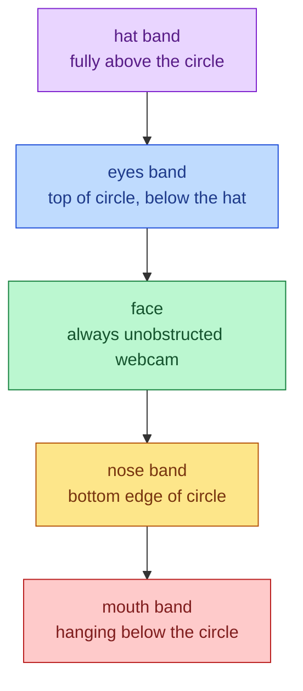

# Gear Anchors

Gear must decorate the webcam bubble without hiding the face. Every slot gets
a band anchored to the circle's edges instead of fixed offsets that drift
into the middle.

## Mutual Understanding

Agreed in conversation on 2026-07-23.

- Hats sit fully above the head, resting on the top of the circle.
- Eye gear sits just below the hat, in the top band inside the circle.
- Nose gear sits at the bottom edge inside the circle.
- Mouth gear hangs just below the circle.
- The middle of the bubble — the face — stays clear no matter which gear is
  equipped.
- A new `nose` slot joins the gear model; Mustache moves to it, Bubble Pipe
  stays a mouth item.

## Bubble Bands

Placement is computed from the sprite's real aspect ratio and the bubble
radius, so any future art drops into its band without touching the face.
