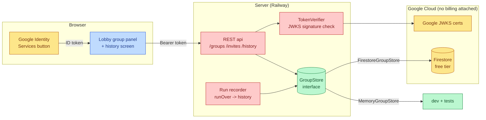
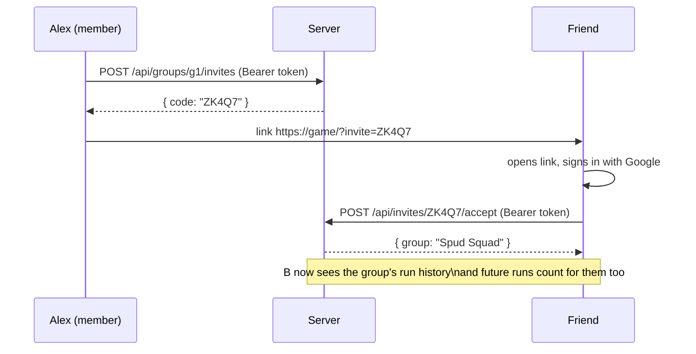
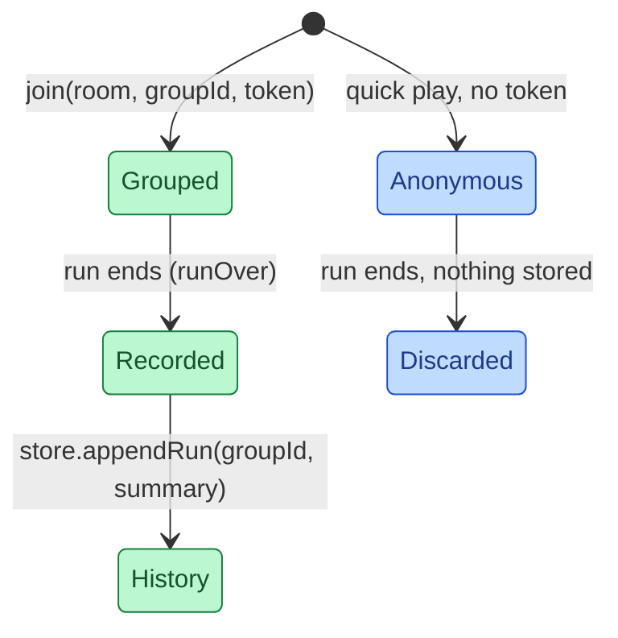

# Group Accounts

Google sign-in, persistent friend groups with run history, and invite links —
layered onto Bullet Friends without breaking anonymous quick-play.

## Mutual Understanding

Agreed in conversation on 2026-07-22.

- Players may sign in with their Google account; anonymous play keeps working.
- A signed-in player can create a group — a named crew of friends.
- Groups accumulate history: every finished run linked to the group is stored
  (date, waves survived, per-player kills/damage/xp/level).
- Groups issue invite links; a friend who opens one and signs in joins the
  group.
- Google resources (OAuth client, Firestore) live in the user's GCP org via
  the alexkancode account.
- Hard budget posture: the project attaches no billing account, so spend is
  structurally $0; the $100 figure is a ceiling we stay far under, with
  alerts only if billing is ever attached.

## Architecture

The seam is `GroupStore` + `TokenVerifier`: tests and local dev run entirely
in memory with a fake verifier; production swaps in Firestore and real Google
JWKS via environment variables. Game rooms never require sign-in — a room is
optionally linked to a group at join time, and only then does the finished
run land in history.

## Invite Flow

## Run Recording

## Cost Posture

| Resource | Plan | Cost |
|---|---|---|
| Google sign-in (Identity Services) | free | $0 |
| Firestore | free tier (1 GiB, 50k reads/day) | $0 |
| OAuth client + consent screen | free | $0 |
| Billing account attached | none | spend impossible |
