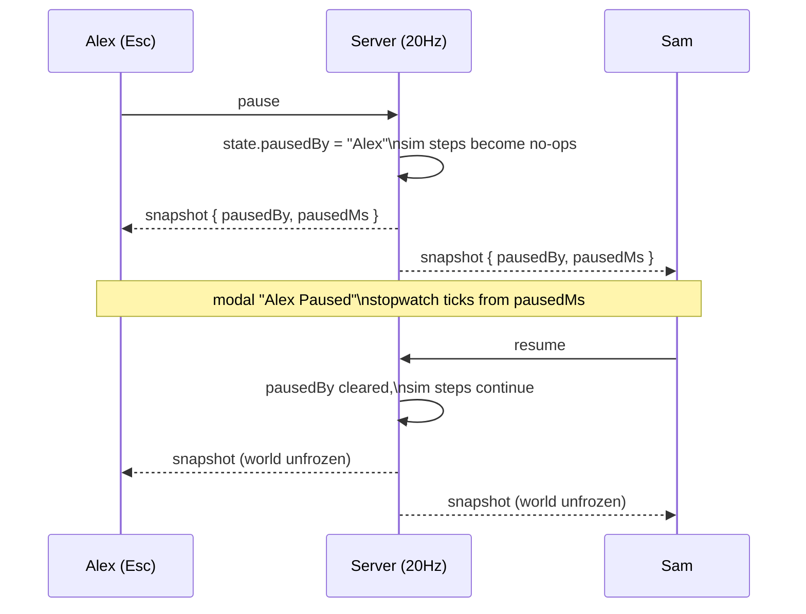
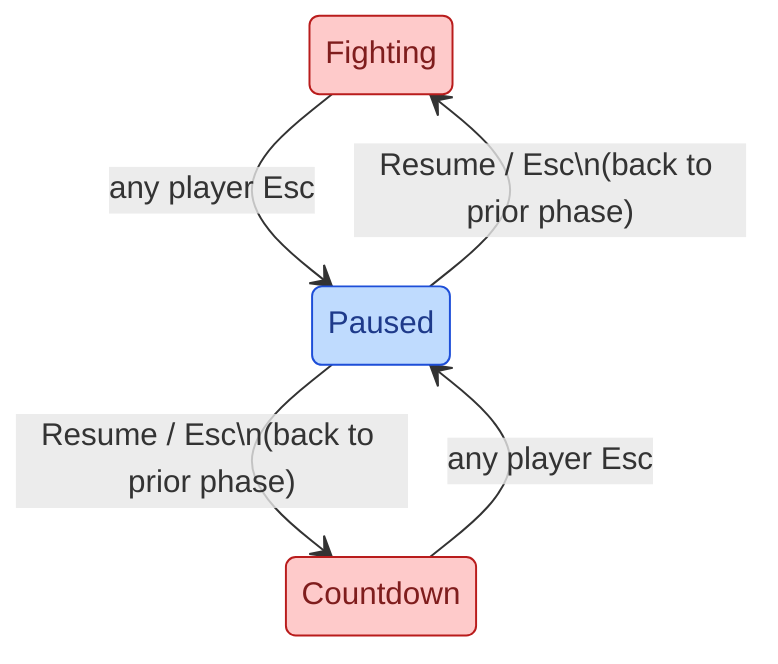

# Group Pause

Any player can freeze the whole room with Esc; everyone sees who paused and
a live stopwatch; anyone can resume. Runs end only when the last player
falls — now pinned by a test as designed behavior.

## Mutual Understanding

Agreed in conversation on 2026-07-25.

- During fighting or the wave countdown, Esc pauses the simulation for the
  entire room, server-authoritatively: enemies, projectiles, orbs, the wave
  timer, and the countdown all freeze.
- Every player sees a modal: "<Player name> Paused" and beneath it
  "Pause time:" with a stopwatch for the current pause instance.
- Any player can resume with the Resume button or by hitting Esc again.
- Pausing is not available in the lobby, shop, or stats screens (the shop
  already holds the game).
- Round-end semantics, confirmed: a run continues until the last player is
  down; players who fall mid-wave revive at half HP when the wave ends. An
  explicit canary test locks this in.

## Pause Flow

Pause state lives inside `GameState`, so it rides the existing snapshots —
late joiners see the pause instantly and no new sync channel is needed.

