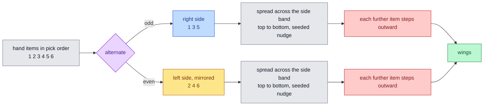
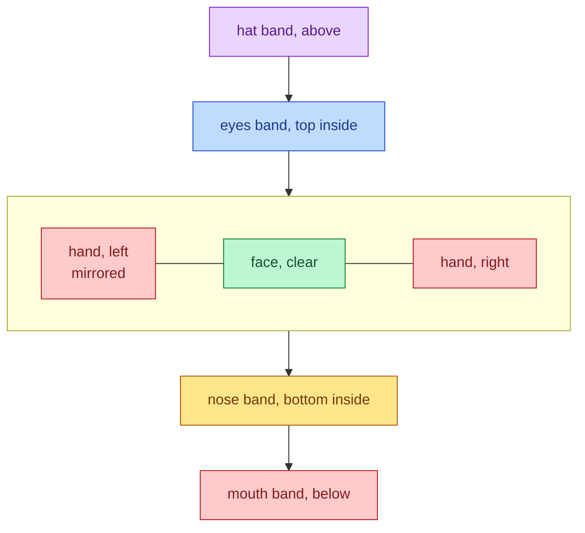

# Hand Wings

A new hand slot for weapons and hand-held objects. Hand items alternate
right and left of the bubble, spread up and down each side with seeded
jitter, and step outward as they stack, so a loaded build reads like wings.

## Mutual Understanding

Agreed in conversation on 2026-09-15.

- Gear gains a fifth slot, `hand`. The slot list lives once in core and the
  design validator and the designer both read it, so custom designs can
  use the slot immediately.
- Three default hand items with original CC0 SVG art in the house style:
  Wooden Sword (+20% damage), Slingshot (+12% attack speed), Torch
  (+15 max HP, +5% move speed). Numbers live in the catalog and are easy
  to tune.
- Placement: hand items alternate sides in pick order, first right, then
  left. Each sits just outside the circle edge, never over the face. Left
  side art is mirrored so it points outward.
- On each side the items spread evenly across a vertical band around the
  centre, each with a seeded vertical nudge, and every further item on a
  side steps a little further out. Seeding is per player, stable per
  frame and identical on every client, as with the existing horizontal
  jitter.
- Stats stack like every other item and the build panel counts them.

## Wing Layout

## Bubble Bands, Updated

