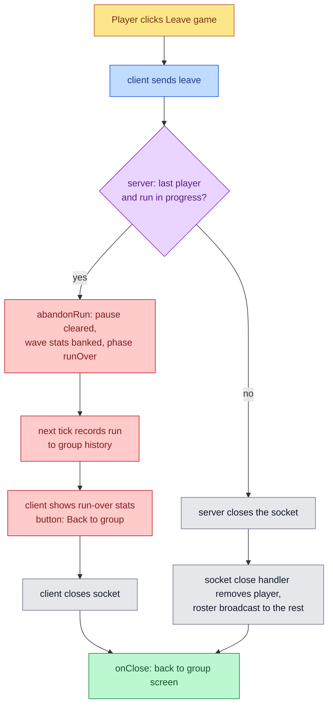
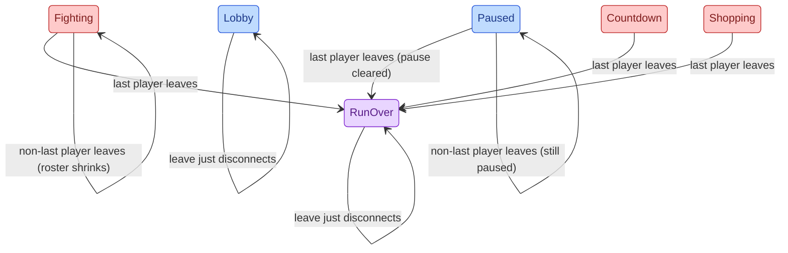

# Leave Game

The pause menu gains a Leave button. Leaving with friends still in the room
returns you to your group screen while they play on. Leaving as the last
player ends the run: you see the run-over stats and the run is recorded.

## Mutual Understanding

Agreed in conversation on 2026-09-14.

- The pause overlay shows two buttons: Resume and Leave game.
- Leaving while other players remain: the leaver's connection closes and
  they land on their group screen (the "ready" step). The others stay in
  the run. If the leaver was the one who paused, the room stays paused
  under their name until someone resumes, exactly as pause works today.
- Leaving as the only player during a run (fighting, shopping, countdown,
  paused or not): the run ends as game over. The leaver stays connected
  long enough to see the run-over stats screen, and the run is appended
  to the group's history like any finished run. The stats screen's button
  then reads "Back to group" and disconnects them.
- Leaving as the only player in the lobby or on the stats screen: nothing
  to end, the connection simply closes.
- The decision of whether a leave ends the run is server-authoritative so
  two players leaving at once cannot both think they were last.
- The protocol version is not bumped: the only change is a new client
  message, which old clients never send.

## Leave Decision

## Phase Transitions

