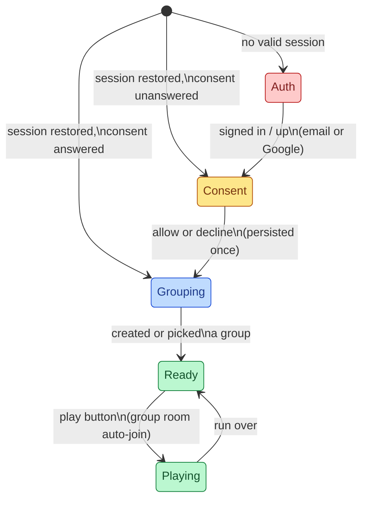
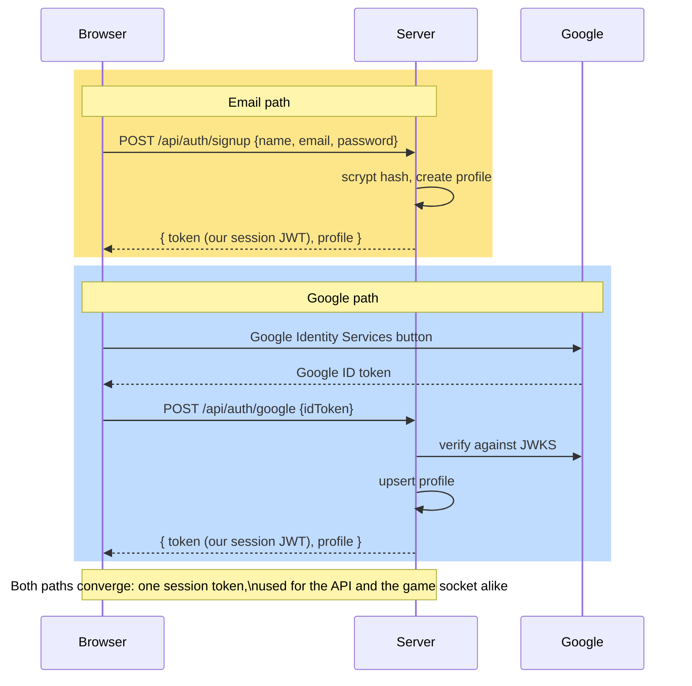

# Onboarding

The app becomes account-first with a staged flow: authenticate, settle webcam
consent once, land in a group, then play. Anonymous quick-play is removed.

## Mutual Understanding

Agreed in conversation on 2026-07-23.

- On load, a modal offers sign in or sign up: email + password, or Google.
  Email sign-up uses a larger intake form (display name, email, password,
  confirm password). Values persist to the player's server-side profile.
- After authentication, the only prompt is webcam consent with a blurb
  explaining why the game wants the camera. "No thanks" is persisted on the
  profile and respected on every future login; those players appear as
  initial-letter bubbles.
- Next, the player creates a group or picks one from the list of groups they
  already belong to.
- Only with an active group do the invite link, run history, and play button
  appear. Play auto-joins the group's shared room (derived from the group
  id) so groupmates land in the same arena; manual room codes are gone.

## Onboarding Flow

## Auth Paths

Both auth paths converge on a server-minted session token, so the rest of
the app (REST API, websocket join, run recording) has exactly one credential
type to verify.
