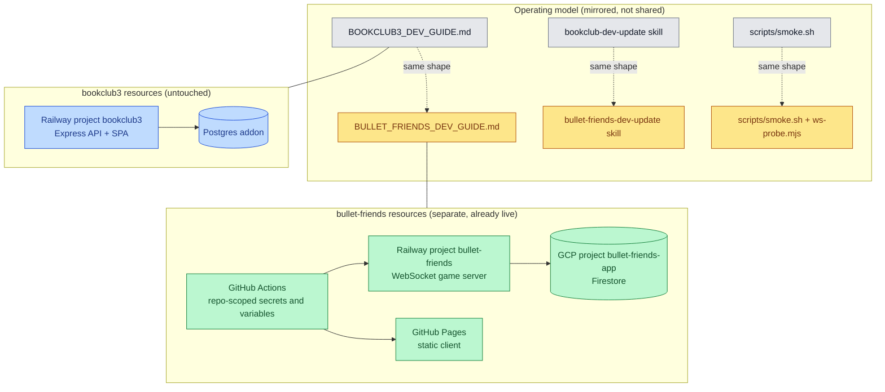
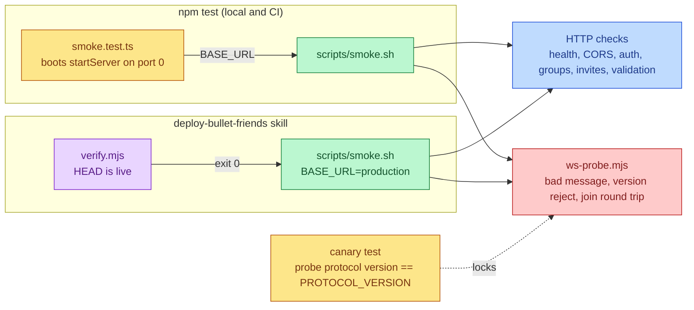

# Ops Parity

Bullet Friends gets the same operating model as bookclub3 (a developer guide,
a matching Claude skill, and a post-deploy smoke script) while keeping its own,
already separate, production infrastructure exactly as it is.

## Mutual Understanding

Agreed in conversation on 2026-09-12.

- The infrastructure is and stays separate from bookclub3: Railway project
  `bullet-friends` for the WebSocket server, GitHub Pages for the static
  client, GCP project `bullet-friends-app` for Firestore, and GitHub Actions
  secrets and variables scoped to this repo. Nothing is shared and nothing
  new is provisioned; both targets are already live at HEAD.
- What is mirrored is the operating model, which is portable across apps:
  - `/home/alex/Desktop/BULLET_FRIENDS_DEV_GUIDE.md` with the same section
    headers as the bookclub3 guide (what and where, workflow contract,
    architecture, commands, deploy and rollout verification, conventions,
    testing map, gotchas, feature inventory, maintenance).
  - A `bullet-friends-dev-update` skill under `~/.claude/skills` that
    mirrors `bookclub-dev-update`: read the guide before any work, follow
    the contract, update the guide after.
  - `scripts/smoke.sh` runnable against local or `BASE_URL` production,
    covering happy and unhappy paths over HTTP and WebSocket, never
    depending on Google or Firestore being reachable.
- The smoke script is wired in twice: the deploy skill runs it against
  production after the commit verification passes, and a vitest
  integration test runs it against an in-process server so it executes in
  `npm test` locally and in CI on every push.
- The deploy pipeline itself (CI to Pages, stamped Railway deploy,
  verification) is unchanged.

## Why separate infrastructure is the right shape

A WebSocket game server holds room state in process memory and runs a
continuous authoritative tick loop, so its health checks, restart policy,
and scaling story differ from a request-driven CRUD app like bookclub3.
Keeping separate projects, secrets, and deploy cadences limits blast radius
and lets each app change at its own pace.

## Resource Separation

## Where Smoke Runs

## Came up during implementation

The first production smoke run surfaced a latent crash: an API handler's
rejected promise (a network timeout reaching Google's token endpoint on the
first Firestore call after idle) escaped the fire-and-forget HTTP router,
Node exited, and Railway restarted the service while the edge answered 502.
The same pattern existed in the room manager's run recording and the
group-link step on join, so one failed Firestore write could drop every
live room. Hardening shipped alongside ops-parity:

- HTTP handler failures now answer 500 `{ error: 'server error' }` and the
  process stays up (`handlerFailure.test.ts`).
- The two other fire-and-forget promises log instead of crash, and boot
  failure exits non-zero.
- Firestore and token-exchange fetches abort after 10 seconds instead of
  hanging for the OS connect timeout.
- ESLint now runs the type-aware `no-floating-promises` rule on package
  sources, with `ignoreVoid: false` for the server so `void promise` is
  rejected where an unhandled rejection kills the process.
