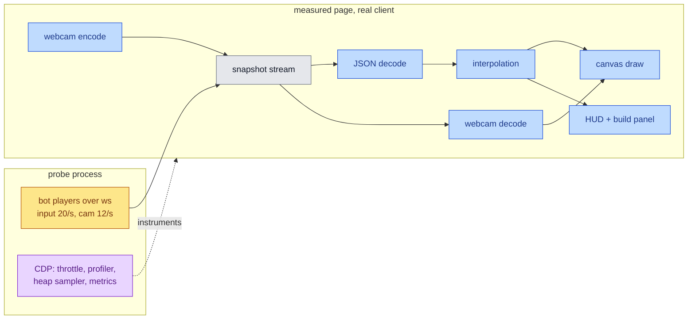
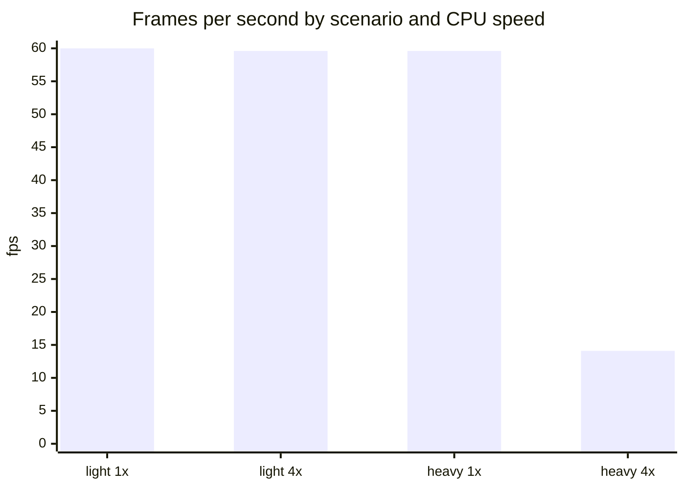
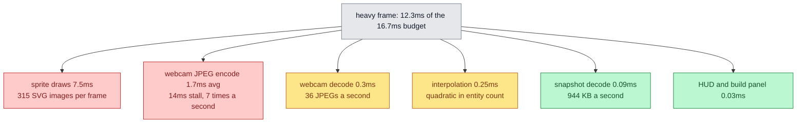

# Peak Frames

A measured analysis of client animation performance, a re-runnable probe that
produces the numbers, and a ranked backlog of the work that would make the
frame budget exemplary.

## Mutual Understanding

Agreed in conversation on 2026-09-15.

- Phase 1, this document set, is analysis only. No app code changes.
- The probe drives the real client in headless Chromium against a real local
  server, with real bot players, real webcam capture and real snapshots.
  Nothing is simulated or stubbed.
- Two scenarios, two CPU speeds: a light room (one player, a handful of
  enemies) and a heavy room (four players with webcams, roughly 315 enemies),
  each at 1x and 4x CPU throttle.
- The frame is broken into stages: snapshot decode, interpolation, canvas
  draw, webcam encode, webcam decode, HUD updates, and garbage.
- Deliverables: this understanding, `analysis.md` with the measurements, an
  `implementation-plan.md` holding the ranked backlog for Phase 2, and
  `tools/perf-probe.mjs` so any change can be measured before and after.
- Phase 2 implements whichever backlog items are chosen, TDD, with the probe
  as the before-and-after evidence.

## What The Probe Measures

## Measured Frame Rate

## Where The Heavy Frame Goes

Self time over a 15 second heavy run at full CPU speed, largest first.

