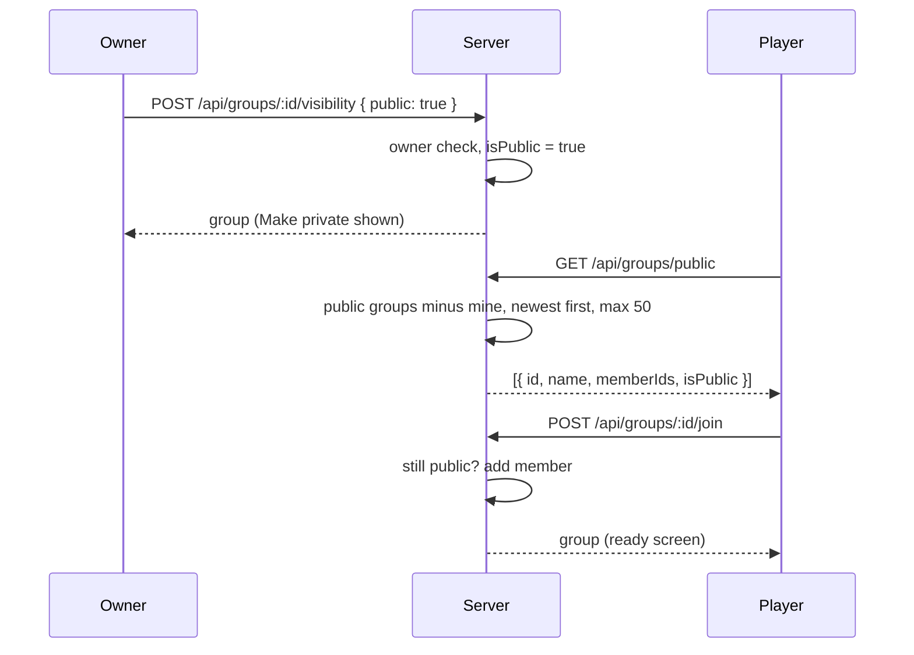
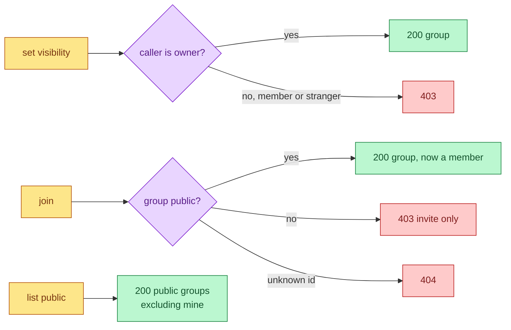

# Public Groups

Group owners can make a crew public. Public crews appear in a list on the
"Pick your crew" step where any signed-in player can join with one click.

## Mutual Understanding

Agreed in conversation on 2026-09-14.

- A group is private by default. Only the owner sees a visibility button on
  the ready screen; it reads "Make public" or "Make private" depending on
  the current state and flips it.
- The crew picker lists public crews you are not already in, newest first,
  with name and member count. Picking one joins you immediately, no invite
  code, and lands you on its ready screen. Private crews stay invite-only.
- Three new API routes: set visibility (owner only), list public groups,
  join a public group. Both stores implement them. Existing groups carry
  no flag and read as private.
- Joining a public group grants the same membership an invite would:
  the shared room, run history, and the ability to create invites.

## Discovery and Join

## Access Rules

