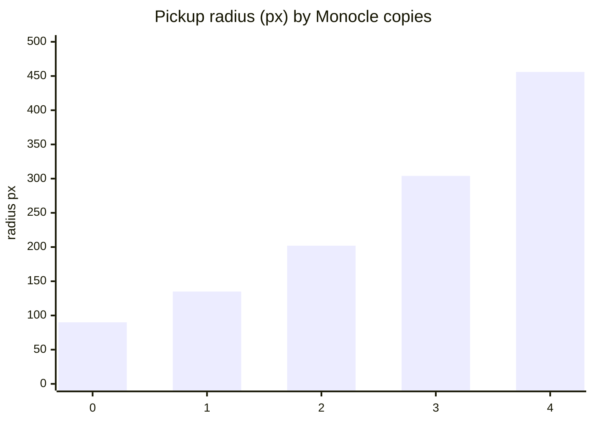
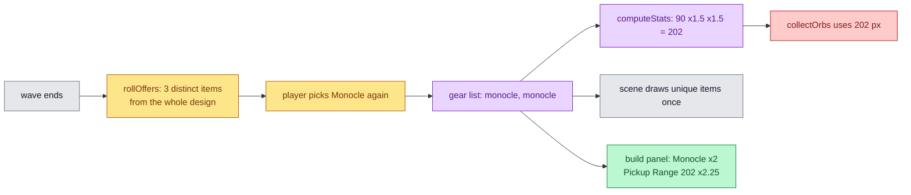

# Stacked Builds

Pickup range becomes a real build choice, items can be picked more than once
and stack, and a build panel on the left of the arena shows what you own and
what it adds up to.

## Mutual Understanding

Agreed in conversation on 2026-09-14, after playing in production.

- Analysis of the current state: base pickup radius is 90 px in a 1600 by
  900 arena; only the Monocle touches it (times 1.35, about 121 px); the
  shop never re-offers an owned item, so no build can stack anything and
  the shop runs dry after eight picks.
- Pickup is made substantial: Monocle becomes times 1.5 per copy,
  compounding. One copy 135 px, two 202 px, three 304 px. Core integration
  tests simulate orb pickup at fixed distances to lock the effect.
- Items stack: the shop may re-offer owned items, each roll still shows
  three different items, every copy applies its modifiers again (flat adds,
  multipliers compound), no cap on copies. The bubble draws each unique
  item once. The shop skips itself only when the design has no gear.
- Build panel: while the HUD is visible, a column on the left lists each
  owned item with a count and the five stats with their current value and
  multiplier against base when changed.

## Pickup Radius by Monocle Count

## Stacking Flow

