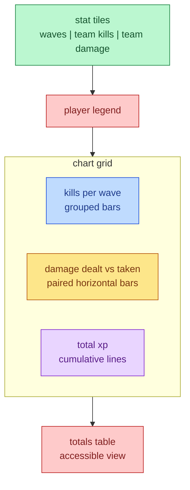

# Stats Variety

The run-over screen graduates from four identical line charts to a mix of
chart forms, each picked for the job its metric does.

## Mutual Understanding

Agreed in conversation on 2026-07-23.

- A headline stat-tile row opens the screen: waves survived, team kills,
  team damage dealt.
- Kills per wave become grouped bars per player — discrete per-round counts.
- Damage becomes a paired horizontal bar per player: dealt (player color)
  beside taken (neutral gray), a direct magnitude comparison.
- XP stays a line, now cumulative, because it tells the growth story.
- Player identity keeps the validated colorblind-safe palette everywhere;
  the totals table view remains for accessibility.

## Screen Composition

Form choices follow the data-viz method: a single headline is a tile, not a
chart; per-round counts are bars; a two-measure comparison per entity is a
paired bar where color carries the entity and position carries the measure;
change-over-time keeps the line.
