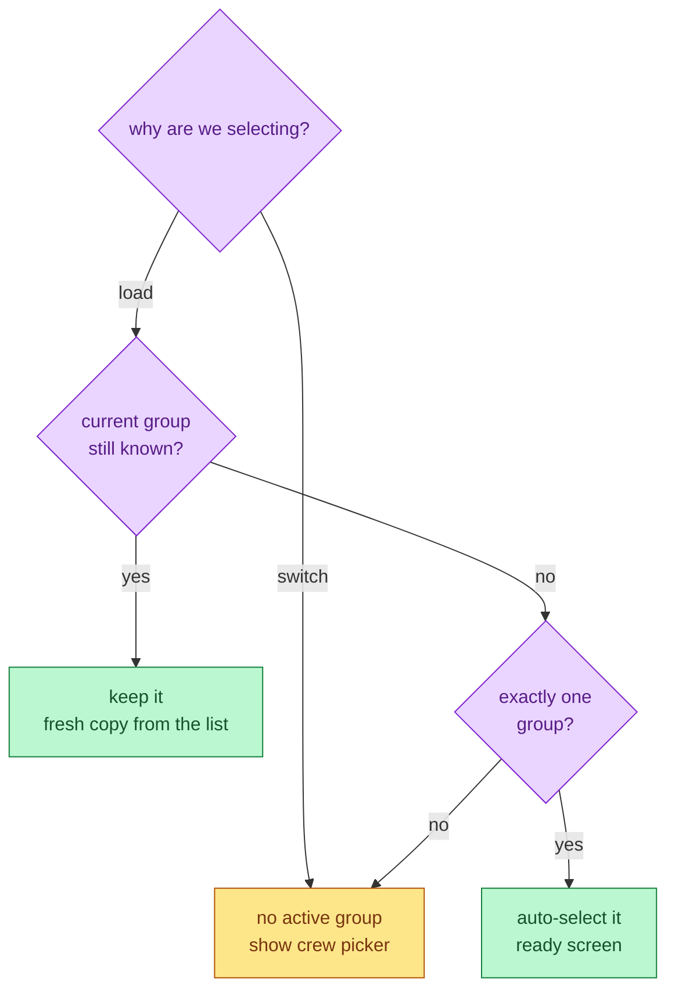
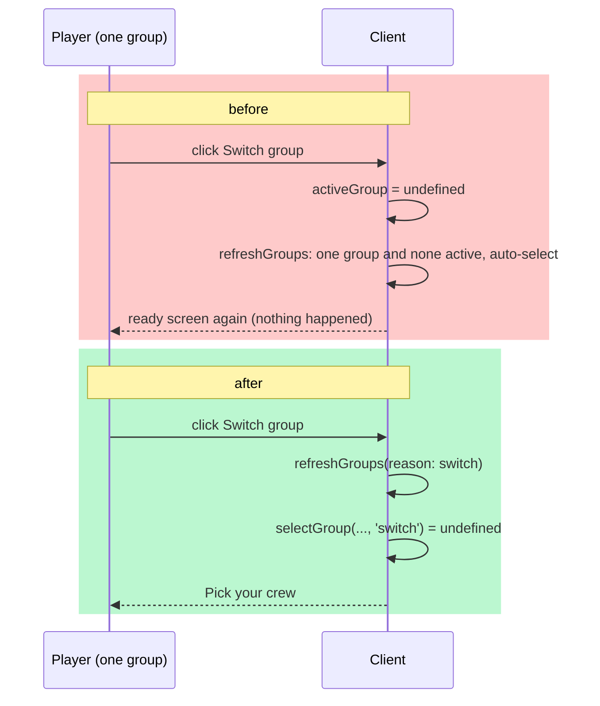

# Switch Group

The Switch group button on the ready screen always takes you to the crew
picker, even when you belong to exactly one group.

## Mutual Understanding

Agreed in conversation on 2026-09-14.

- Symptom: in production and locally, clicking Switch group with a single
  group did nothing. The handler cleared the active group and refreshed
  the list, but the refresh's "auto-select the only group" rule re-picked
  it immediately, so the screen never changed.
- Fix: the group selection rule becomes a pure function that knows why it
  is being asked. On first load a lone group is still auto-selected. On an
  explicit switch nothing is selected, so the crew picker shows and the
  player can pick, create a new group, or follow an invite link.
- No server change. No new markup. The button, its label and its styles
  stay as they are.

## Selection Rule

## Before and After

