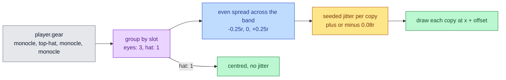

# Worn Stacks

Every copy of an item is drawn on the bubble, and items sharing a slot are
spread left to right with a stable, seeded jitter so a stack reads at a
glance.

## Mutual Understanding

Agreed in conversation on 2026-09-15.

- Stat stacking already applies to every item (each copy in the gear list
  applies its modifiers again). No numeric change.
- The bubble draws every copy instead of one per unique item.
- Items that share a slot, duplicates or different items on the same
  anchor, are spread horizontally across the slot band in pick order, with
  a small random jitter on top. A single item in a slot stays centred.
- The jitter is deterministic: seeded from the player id, so it never
  flickers between frames and every client renders the same bubble.

## Spread and Jitter

